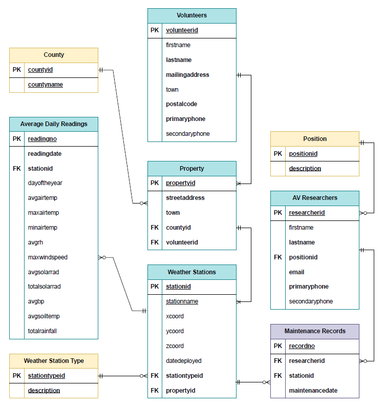
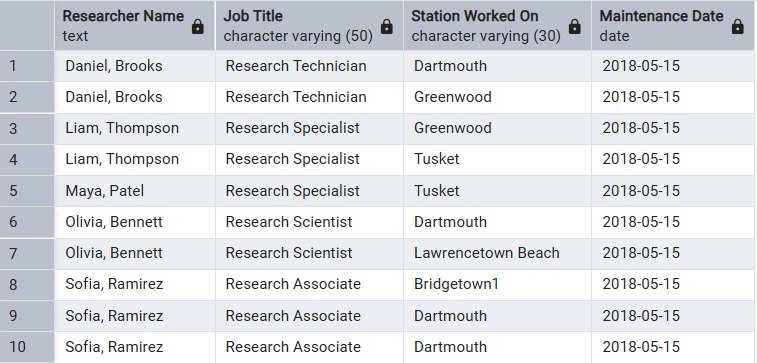
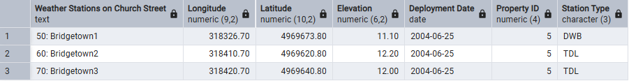
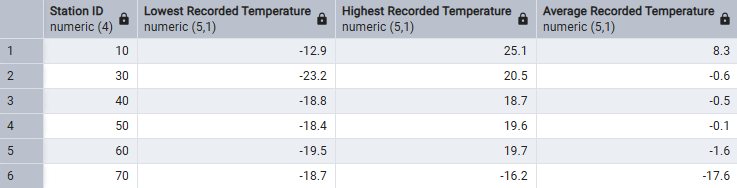
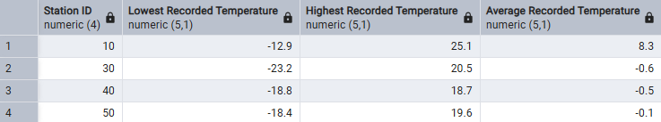

# Database Management - PostgreSQL<br><br>

## Case Study: AV Weather Stations: Designing, Creating, Populating, and Querying a Database<br><br>

<b>Purpose:</b> Provided with a case study for a hypothetical small local research company called AV Research develop an entity-relationship diagram for the proposed database design, implement the model in PostgreSQL using pgAdmin, query database using SELECT <br>
<b>Output:</b> Entity relationship diagram, PostgreSQL Database, SQL Select Query Results <br>


### Phase 1: Entity Relationship Diagram<br><br>

Case Study:<br>
> A small local research company – AV Research – operates approximately 70 weather stations throughout the Annapolis Valley. They would like to develop a database to organize the data they collect from their weather stations.<br><br>
> For each individual **weather station**, AV Research records the *name of the station, the x,y,z co-ordinates (in NAD83 UTM Z20), the date the station was deployed*, and the ***type of station***, which can be: *Temperature Datalogger, DryWet Bulb, Tower/Tripod, or Meteorological Station*.<br><br>
> Weather stations are located on the properties of **private citizens** who volunteer their land. AV records the *name, mailing address (including town and postal code), and phone number* for each volunteer, and the *street address, town* and ***county*** for each **property**. A volunteer can have several properties, and each property belongs to a single volunteer. A property can contain several weather stations.<br><br>
> Each weather station records several **readings** (depending on the type of station) hourly. Once a day, the readings are averaged for the day. WeatherDataSample.csv contains a sample of daily readings taken from various weather stations.<br><br>
> **AV researchers** (*name*, ***position***, *email address, and phone number*) maintain the weather stations. The **maintenance records** include the *researcher, the station, and the date the maintenance was performed*. A researcher can work on multiple stations, and multiple researchers can maintain a station.<br><br>
> *Case study provided by NSCC for coursework purposes.*<br><br>
> *Formatting and highlights added for the purpose of emphasizing my workflow and reasoning.*
<br>

The following ERD was developed from the above case study and includes:
- Entities (blue), references entities (yellow), and connecting entities (purple)
  - Entities: Weather stations, volunteers, properties, readings, and AV researchers
  - Reference entities were developed from the following attributes to enforce data integrity: Researcher position, weather station type, and county
    - Many volunteers may belong to the same county
    - Many researchers may hold the same position
    - Many weather stations may be the same type
  - Connecting entity: Maintenance records
    - Resolves the many to many relationship wherein each researcher can maintain many stations, and each station can be maintained by many researchers
- Indication of required (bold), unique (underlined), primary key (PK), and foreign key (FK) attributes
- Cardinality (crows foot notation)
<br>

<br>
*AV Research ERD for proposed database design*<br><br>

 ### Phase 2: Implement the model in a DBMS<br><br>

***Create AVResearch Database***<br><br>

`CREATE DATABASE AVResearch;`<br><br>

*The following tables were created in the AVResearch Database based on a provided ERD similar to that developed above*<br><br>

Drop tables if they exist, dropping child tables before parent tables

```
DROP TABLE IF EXISTS maintenance CASCADE;
DROP TABLE IF EXISTS researcher CASCADE;
DROP TABLE IF EXISTS researchposition CASCADE;
DROP TABLE IF EXISTS reading CASCADE;
DROP TABLE IF EXISTS weatherstation CASCADE;
DROP TABLE IF EXISTS stationtype CASCADE;
DROP TABLE IF EXISTS property CASCADE;
DROP TABLE IF EXISTS volunteer CASCADE;
DROP TABLE IF EXISTS county CASCADE;
```

<br> 

Create tables (Note: Not all tables shown. Selected table creation scripts shown for demonstration purposes).

```
-- Create volunteer table
CREATE TABLE volunteer(
volunteerid NUMERIC(6) PRIMARY KEY,
lastname VARCHAR(40) NOT NULL,
firstname VARCHAR(40) NOT NULL,
poboxcivic VARCHAR(10),
streetroad VARCHAR(100),
town VARCHAR(100),
postalcode CHAR(7),
phonenumber CHAR(12)
);

-- Weather Station Table
CREATE TABLE weatherstation(
stationid NUMERIC(6) PRIMARY KEY,
stnname VARCHAR(50) NOT NULL,
xcoordinate NUMERIC(9,2),
ycoordinate NUMERIC(10,2),
zcoordinate NUMERIC(8,2),
deploymentdate DATE,
property NUMERIC(6) NOT NULL REFERENCES property(propertyid),
stationtype CHAR(3) NOT NULL REFERENCES stationtype(stationtypecode)
);

CREATE TABLE reading(
readingid NUMERIC(10) PRIMARY KEY,
readingdate DATE DEFAULT CURRENT_DATE NOT NULL,
stationid NUMERIC(2) NOT NULL REFERENCES weatherstation(stationid),
dayofyear NUMERIC(3),
avgairtemp NUMERIC(6,2),
maxairtemp NUMERIC(6,2),
minairtemp NUMERIC(6,2),
avgrh NUMERIC(5,2),
maxwindspeed NUMERIC(5,2),
avgsolarrad NUMERIC(4,2),
totalsolarrad NUMERIC(5,2),
avgbp NUMERIC(4),
avgsoiltemp NUMERIC(6),
totalrainfall NUMERIC(5,1)
);
```
<br>

Populate database (Note: Not all data entry is shown, selected scripts shown for demonstration).

```
-- Delete records from tables
DELETE FROM county;
DELETE FROM stationtype;
DELETE FROM researchposition;
DELETE FROM volunteer;
DELETE FROM property;
DELETE FROM researcher;
DELETE FROM weatherstation;
DELETE FROM maintenance;

-- Volunteer Table
INSERT INTO volunteer VALUES 
(1, 'MacDonald','Donald','345','Lillian Drive','Dartmouth'),
(2, 'Cameron','Adam','55','David Drive','Lawrencetown Beach'),
(3, 'Smith','Mark','POBox 45','Roberts Road','Tusket'),
(4, 'MacLean','David','5','Maplewood Lane','Greenwood'),
(5, 'Verran','Jimmy','17','Church Street','Bridgetown');

SET datestyle TO 'ISO,MDY';

INSERT INTO weatherstation VALUES 
(10,'Dartmouth',459824.80,4947804.15,15.5,'06/11/2002',1,'MET'),
(20,'Lawrencetown Beach',473865.05,4944025.25,10.5,'07/09/2001',2,'TT'),
(30,'Tusket',260923.55,4860052.30,8.2,'05/21/2003',3,'MET'),
(50,'Bridgetown1',318326.70,4969673.80,11.1,'06/25/2004',5,'DWB'),
(60,'Bridgetown2',318410.70,4969620.80,12.2,'06/25/2004',5,'TDL'),
(70,'Bridgetown3',318420.70,4969640.80,12.0,'06/25/2004',5,'TDL');

-- import Reading records
copy reading (readingdate,stationid ,dayofyear,avgairtemp,maxairtemp,minairtemp,
             avgrh,maxwindspeed,avgsolarrad,totalsolarrad,avgbp,avgsoiltemp,
             totalrainfall)
from 'C:\temp\WeatherDataSample.csv' delimiter ',' csv header;
```
<br>

**Query AV Weather Stations Database**<br><br>

**Query # 1: Multi-Table Join**<br>
*Query the Weather database to list the researcher name (combining researchers’ first, then last names in one output column), their job titles, the station name of the station they worked on and the dates of maintenance. Order the results by sorting for researcher name then station name.* <br>
```
SELECT 
	firstname ||', '|| lastname "Researcher Name", 
	description "Job Title", 
	stnname "Station Worked On", 
	maintdate "Maintenance Date"
FROM researcher JOIN position
ON researcher.position = position.code
JOIN maintenance
ON maintenance.researcher = researcher.researcherid
JOIN weatherstation
ON weatherstation.stationid = maintenance.station
ORDER BY "Researcher Name", stnname;
```
<br>

<br>

*Query 1 Result*<br><br>

**Query # 2: Subquery**<br>
*Using a subquery, query out the records in the Weatherstation database table, that list the weather station names located on Church Street. The subquery should determine the property ID(s) based on the street address.* <br>
```
SELECT 
	stationid ||': '|| stnname "Weather Stations on Church Street", 
	xcoordinate "Longitude", 
	ycoordinate "Latitude", 
	zcoordinate "Elevation", 
	deploymentdate "Deployment Date", 
	property "Property ID", 
	stationtype "Station Type"
FROM weatherstation
WHERE property =
	(SELECT propertyid
	FROM property
	WHERE streetroad LIKE 'Church Street');
```
<br>

<br>

*Query 2 Result*<br><br>

**Query #3: Aggregate**<br>
*Using aggregates, query the reading database showing stationid along with the lowest recorded temperature, highest recorded temperature and the average temperature of all of the readings taken, summarized by weather station. Show only one decimal place for all values and assign the appropriate column headings.* <br>
```
SELECT 
	stationid "Station ID", 
	min(minairtemp)::numeric(5,1) "Lowest Recorded Temperature", 
	max(maxairtemp)::numeric(5,1) "Highest Recorded Temperature", 
	avg(avgairtemp)::numeric(5,1) "Average Recorded Temperature"
FROM reading
GROUP BY stationid
ORDER BY stationid;
```
<br>

<br>

*Query 3 Result*<br><br>

**Query # 4: Group By Having**<br>
*Modify Query #9 to show the stations that have an overall average temperature greater than -1. Show only one decimal place for all values and assign the appropriate column headings.* <br>
```
SELECT 
	stationid "Station ID", 
	min(minairtemp)::numeric(5,1) "Lowest Recorded Temperature", 
	max(maxairtemp)::numeric(5,1) "Highest Recorded Temperature", 
	avg(avgairtemp)::numeric(5,1) "Average Recorded Temperature"
FROM reading
GROUP BY stationid
HAVING avg(avgairtemp) > -1
ORDER BY stationid;
```
<br>

<br>

*Query 4 Result*<br><br>

### Disclaimer <br>

*Produced by: T.K.Wolfe, November 2025* <br>
*This product is intended for educational purposes only for the Geographic Information Sciences program at the Centre of Geographic Sciences, NSCC.* <br><br>
