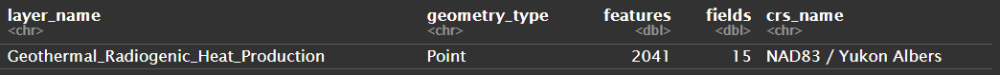
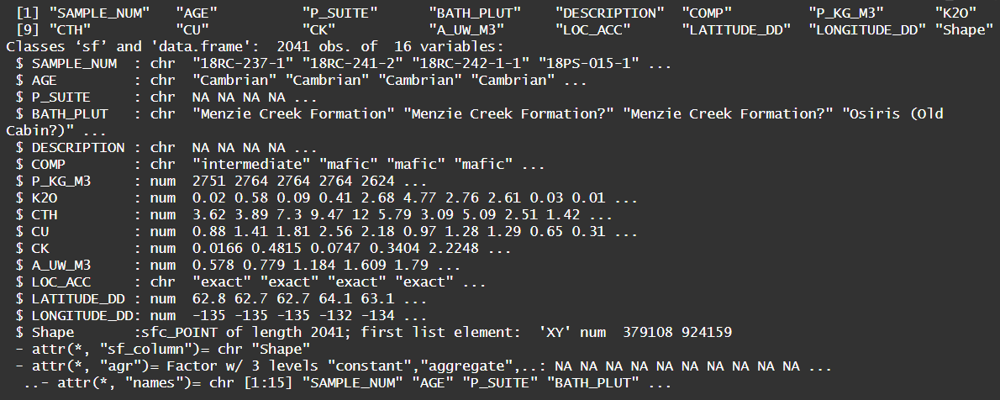
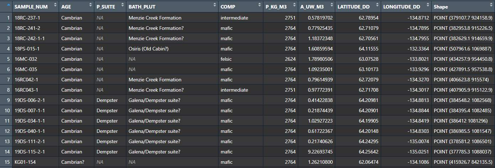
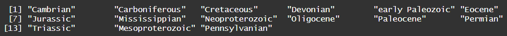
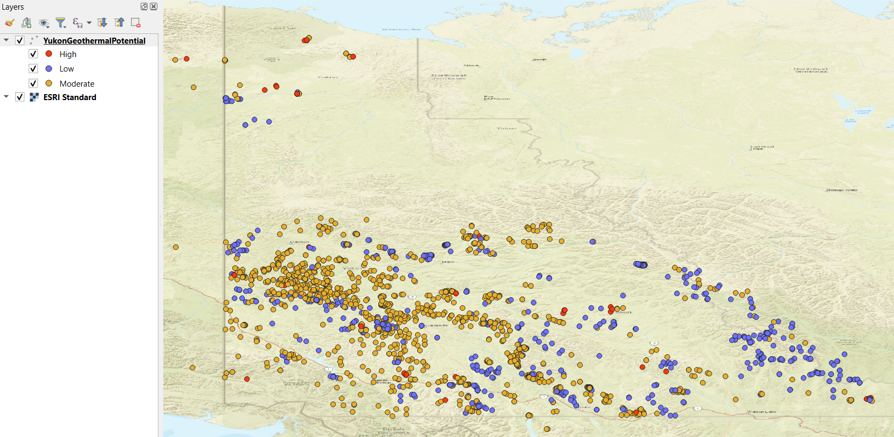

# Extract, Transform, Load - R<br><br>

## Geothermal Potential in the Yukon: Building an ETL Pipeline for Geospatial Data Analysis <br><br>

<b>Purpose:</b>
Design and build a custom ETL pipeline tailored for geospatial data analysis of geothermal potential and drilling suitability of sites in Yukon, Canada. Independently locate, assess, and extract a geospatial dataset and apply data cleaning and transformation techniques to handle missing values, correct errors, and ensure consistency. Final result will be a Tidy dataset designed to help target exploration for geothermal resources loaded into a local database for future use, alongside a thoroughly documented R Notebook (.Rmd file). <br>
<b>Output:</b> gpkg, Rmd <br><br>

### Background <br><br>
The Canadian Federal government has shown interest in Northern geothermal projects, with Natural Resources Canada having invested $2 million in the Yukon government's exploration of the potential of geothermal energy as a long term renewable energy source for communities currently powered by diesel. The Yukon government has been compiling geothermal data, including data on radiogenic heat production, boreholes, and thermal springs. The goal of this assessment is to build an ETL pipeline for cleaning and preparing the geothermal dataset for further analysis, including adding new attributes for geothermal potential and drilling suitability, which will be relevant for determining which locations have the highest geothermal potential and the best drilling conditions.

<br><br>

### Data Sourcing and Extraction <br><br>

<b>Data sourced from:</b> Yukon Geological Survey, 2024. Geothermal dataset. Yukon Geological Survey, 
https://data.geology.gov.yk.ca/Compilation/42 [accessed Nov 19, 2025]. <br>
<b>Files downloaded:</b> Geothermal_Radiogenic_Heat_Production.fgdb.zip and Geothermal_Dataset_Metadata.zip <br><br>

Extract files and bring data into RStudio by reading directly from the geodatabase: <br>

```
# Load sf package for spatial manipulation
library(sf)

# Check which layers are inside the geodatabase
st_layers("Datasets/Yukon_RadiogenicHeatProd/Geothermal_Radiogenic_Heat_Production.gdb")

# Read the Geothermal_Radiogenic_Heat_Production layer and save as a data frame
data <- st_read("Datasets/Yukon_RadiogenicHeatProd/Geothermal_Radiogenic_Heat_Production.gdb", layer = "Geothermal_Radiogenic_Heat_Production")
```

<br>
*Data frame showing that there is one layer called "Geothermal_Radiogenic_Heat_Production" in the geothermal dataset*
<br><br>

### Choosing Relevant Data <br><br>

```
# View the geothermal data frame
View(data)

# View column names and associated data types
names(data)
str(data)
```

<br>
*Result shows the column names (SAMPLE_NUM, AGE, etc) with their associated data types (chr, num, etc)*
<br><br>

| Column Name  | Data Type | Title                                                             | Description                                                                                                 |
|--------------|-----------|-------------------------------------------------------------------|-------------------------------------------------------------------------------------------------------------|
| SAMPLE_NUM   | chr       | Sample Number                                                     |                                                                                                             |
| AGE          | chr       | Age of pluton/sample                                              | The geologic period during which an intrusion crystallized from magma underground.                          |
| P_SUITE      | chr       | Plutonic Suite                                                    | A group of related intrusive igneous bodies that share similar age, composition, and/or geologic origin.    |
| BATH_PLUT    | chr       | Name of the Batholith or Pluton the sample is derived from        | A batholith is very large pluton or composite of many plutons.                                              |
| DESCRIPTION  | chr       | Description of sample                                             |                                                                                                             |
| COMP         | chr       | Composition of sample (e.g., felsic, intermediate, mafic)         | Describes the silica content and mineralogy of the rock.                                                    |
| P_KG_M3      | num       | Density of sample (in kilogram per cubic meter)                   |                                                                                                             |
| K2O          | num       | Potassium Oxide                                                   |                                                                                                             |
| CTH          | num       | Concentration of Thorium                                          |                                                                                                             |
| CU           | num       | Concentration of Uranium                                          |                                                                                                             |
| CK           | num       | Concentration of Potassium                                        |                                                                                                             |
| A_UW_M3      | num       | Potential radiogenic heat production (micro-Watt per cubic meter) | Total heat generated within a rock by radioactive decay of uranium (U), thorium (Th), and potassium-40 (K). |
| LOC_ACC      | chr       | Presumed accuracy of coordinates                                  |                                                                                                             |
| LATITUDE_DD  | num       | Feature location latitude in GCS_WGS_1984                         |                                                                                                             |
| LONGITUDE_DD | num       | Feature location longitude in GCS_WGS_1984                        |                                                                                                             |
| Shape        | sfc_point |                                                                   |                                                                                                             |

<br>

The following variables will be used to:<br>
- Assess geothermal potential: <b>Age of sample (AGE), potential radiogenic geat production (A_UW_M3)</b>
- Assess Drilling suitability: <b>Composition of sample (COMP), density of sample (P_KG_M3)</b>
- Classify sample: <b>Sample number (SAMPLE_NUM), Plutonic suie (P_SUITE), name of Batholith/Pluton (BATH_PLUT)</b>
- Geospatially locate sample: <b>LATITUDE_DD, LONGITUDE_DD</b>
<br>

The following variables will be removed from the dataset: <br>

- Description: Null for all samples
- Potassium Oxide (K2O), Concentration of Thorium (CTH), Concentration of Uranium (CU), Concentration of Potassium (CK): These were already used to calculate radiogenic heat production, so it won't be necessary to use them directly
- Accuracy of Coordinates: 'exact' for all samples
- Shape: The geometry column is not in WGS84, so the provided lat and long coordinates will be used to form a new geometry column instead
<br>

### Data Cleaning <br><br>

<b>Removing Variables</b><br><br>

```
# Create new data frame with only chosen variables using dplyr select function
library(dplyr)

data_col = select(data, SAMPLE_NUM, AGE, P_SUITE, BATH_PLUT, COMP, P_KG_M3, A_UW_M3, LATITUDE_DD, LONGITUDE_DD)
```
<br>

<br>
*New data frame 'data_col' showing only the chosen variables of interest*
<br><br>

<b>Data Type Casting</b><br><br>
While the data types are correct for this dataset and don't need to be modified, if there were issues the following code could be applied:<br>

```
data$SAMPLE_NUM <- as.character(data$SAMPLE_NUM)
data$AGE <- as.character(data$AGE)
data$P_SUITE <- as.character(data$P_SUITE)
data$BATH_PLUT <- as.character(data$BATH_PLUT)
data$COMP <- as.character(data$COMP)
data$P_KG_M3 <- as.numeric(data$P_KG_M3)
data$A_UW_M3 <- as.numeric(data$A_UW_M3)
data$LATITUDE_DD <- as.numeric(data$LATITUDE_DD)
data$LONGITUDE_DD <- as.numeric(data$LONGITUDE_DD)
```
<br>

<b>Update Spatial Reference Frame</b><br><br>
The geometry 'Shape' column will be removed manually, since the coordinates are not represented in WGS84. Using the provided latitude and longitude coordinates, a new geometry column will be created.<br>

```
# Delete geometry 'Shape' column
data_nosf = st_drop_geometry(data_col)

# Create a new spatial data frame using the provided WGS84 lat and long coordinates
# st_as_sf: Create a sf object from a non-geospatial tabular dataframe
data_sf <- data_nosf %>% st_as_sf(coords = c("LONGITUDE_DD", "LATITUDE_DD"), crs = 4326) # WGS84 coordinate system
```
<br>

<b>Handling Missing Values</b><br><br>
Some variables in the data frame are necessary for geothermal potential and drilling suitability analysis, while others are less critical. If essential data is missing, rows containing the missing data will be deleted altogether. If non-essential data is missing, the NA values can simply be replaced with "Unknown".<br><br>

Columns deemed essential include: Age, composition, density, heat production, and geometry. If any of these values are NA, "?" or "", the row will be deleted.<br>
```
# Drop rows where columns required for geothermal analysis are NA
library(tidyr)
data_drop <- drop_na(data_sf, AGE, COMP, P_KG_M3, A_UW_M3, geometry)

# Delete rows where columns required for geothermal analysis contain a question mark or a blank string
# Use dplyr filter function to remove rows where the data meets a certain criteria
# Use grepl for pattern matching (grepl(pattern,x)). Look for '?". Use \\ escape character since '?' is reserved
data_drop2 <- data_drop %>%
  filter(AGE != "",
         COMP != "",
         !grepl("\\?", AGE), 
         !grepl("\\?", COMP)
  )
```
<br>

Columns deemed non-essential, even if useful, include: Sample name, suite, and batholith. Geothermal potential and drilling suitability can still be assessed if these are missing. If these are missing or "", the values will be marked as "Unknown". Question marks will be left unchanged, as some rows contain names with question marks at the end.<br>

```
data_replace <- replace_na(data_drop2, list(SAMPLE_NUM = "Unknown", P_SUITE = "Unknown", BATH_PLUT = "Unknown"))

# Use dplyr mutate function to replace blank strings with "Unknown"
# Use if_else(condition, true, false) to replace blank values
data_replace2 <- data_replace %>%
  mutate(SAMPLE_NUM = if_else(SAMPLE_NUM == "", "Unknown", SAMPLE_NUM), 
    P_SUITE = if_else(P_SUITE == "", "Unknown", P_SUITE),
    BATH_PLUT = if_else(BATH_PLUT == "", "Unknown" ,BATH_PLUT))
```
<br>

<b>Merging / Joining Data Frames</b><br><br>
In order to classify the geologic ages as "young", "moderately old", and "old", quantitative values are required rather than the provided age classifications (ex. Cambrian, Cretaceous, etc.).<br><br>

Data frame will be merged with a CSV file that associates age classifications with their mid-ages ((start age + end age) / 2) (in millions of years)<br>

```
# Unique values from the AGE column were used to create the GeologicAge CSV file, along with the ICGC chart
unique(data_replace2$AGE)
```


<br><br>

```
library(readr)

# Read Geologic Age CSV file
geologicage <- read_csv("Datasets/GeologicAges.csv")

# Join the GeologicAge data frame with the data_replace2 data frame
# A left join was used to join the matching values from GeologicAge.csv to the data frame, keeping all rows from data_replace2. This creates a new column called "Age_Ma, associating every classification in the Age column with a numeric value, represented in millions of years.
age_joined <- data_replace2 %>%
  left_join(geologicage, by = "AGE")

# Cast Age_Ma column to a numeric data type if not already
age_joined$Age_Ma <- as.character(age_joined$Age_Ma)
```
<br>

<b>Rename Columns</b><br><br>
Columns are re-named using the intuitive titles provided in the downloaded metadata document. <br>

```
data_name <- age_joined %>%
  rename(`Sample Number` = SAMPLE_NUM,
         `Pluton/Sample Age` = AGE,
         `Plutonic Suite` = P_SUITE,
         `Batholith/Pluton Name` = BATH_PLUT,
         `Composition` = COMP,
         `Density (kg/m3)` = P_KG_M3,
         `Potential Radiogenic Heat Production (uW/m3)` = A_UW_M3,
         `Geologic Age (Millions)` = Age_Ma,
         `Coordinates (WGS84)` = geometry)
```
<br>

<b>Fix Capitalization Issues</b><br><br>
Composition values are all in lowercase, while other columns contain categorical data where the first word is capitalized but the others are not. The data will be updated to ensure title formatting for all categorical variables, with the exception of the Sample Number column.<br><br>

<br>

```
# Import stringr library to manipulate strings
library(stringr)

# Capitalize only the first letter of each word in the specified character columns using mutate and str_to_title
data_capital <- data_name %>%
  mutate(
    `Pluton/Sample Age` = str_to_title(`Pluton/Sample Age`), # str_to_title capitalized the first letter of each word
    `Plutonic Suite` = str_to_title(`Plutonic Suite`),
    `Batholith/Pluton Name` = str_to_title(`Batholith/Pluton Name`),
    `Composition` = str_to_title(`Composition`),
    `Presumed Coordinate Accuracy` = str_to_title(`Presumed Coordinate Accuracy`),
    `Geologic Age (Millions)` = str_to_title(`Geologic Age (Millions)`)
  )
```
<br>

<b>Create New Categorical Variables by Binning</b><br><br>

The two categorical variables of interest are Geothermal Potential, and Drilling Suitability. In order to create the Geothermal Potential column, ranking systems were first applied to the Potential Radiogenic Heat Production and Geologic Age columns, creating a 'Heat Score' and a 'Geologic Age Score'. These two rankings were then added, to create a final 'Geothermal Potential Score' binned into three categories - low, moderate, or high. <br><br>

A similar process was used in order to determine Drilling Suitability. First a 'Density Score' column was added, and then a 'Composition Score' column was added, both based on a Low/Medium/High (1/2/3) ranking. Adding these two columns, a 'Drilling Suitability' column was created. <br><br>

While the Geothermal Potential and Drilling Suitability columns were be retained, the intermediate columns were deleted. <br>

```
# Apply radiogenic heat production ranking (Low [1]: < 3 uW/m3, Moderate [2]: 3-5 uW/m3, High [3]: > 5 uW/m3)
data_heat <- data_capital %>%
  mutate(`Heat Score` = case_when(
    `Potential Radiogenic Heat Production (uW/m3)` < 3 ~ 1,
    `Potential Radiogenic Heat Production (uW/m3)` >=3 & `Potential Radiogenic Heat Production (uW/m3)` <= 5 ~ 2,
    `Potential Radiogenic Heat Production (uW/m3)` > 5 ~ 3
  ))

# Apply geologic age ranking (Low [1]: > 180 million yr, Moderate [2]: 61 - 180 million yr, High [3]: > 5 uW/m3 < 61 million yr)
data_age <- data_heat %>%
  mutate(`Age Score` = case_when(
    `Geologic Age (Millions)` < 61 ~ 3,
    `Geologic Age (Millions)` >= 61 &  `Geologic Age (Millions)` <= 180 ~ 2,
    `Geologic Age (Millions)` > 180 ~ 1
  ))

# Create geothermal potential score by adding heat and age rankings (Low: 2-3, Moderate: 4-5, High: 6)
data_geothermal <- data_age %>%
  mutate(`Geothermal Potential` = case_when(
    (`Heat Score` + `Age Score`) <= 3 ~ "Low",
    (`Heat Score` + `Age Score`) >= 4 & (`Heat Score` + `Age Score`) <= 5 ~ "Moderate",
    (`Heat Score` + `Age Score`) == 6 ~ "High"
  ))

# Apply density ranking (Low [1]: < 2000 and > 3000 kg/m3, Moderate [2]: 2700 - 3000 kg/m3, High [3]: 2000 - 2700 kg/m3)
data_density <- data_geothermal %>%
  mutate(`Density Score` = case_when(
    `Density (kg/m3)`< 2000 & `Density (kg/m3)` > 3000 ~ 1,
    `Density (kg/m3)` >= 2700 & `Density (kg/m3)` <= 3000 ~ 2,
    `Density (kg/m3)` >= 2000 & `Density (kg/m3)` <= 2700 ~ 3
  ))

# Apply composition ranking (Low [1]: Lamprophyre and Ultramafic, Moderate [2]: Intermediate and Mafic, High [3]: Felsic and felsic-intermediate)
data_comp <- data_density %>%
  mutate(`Composition Score` = case_when(
    `Composition` == "Lamprophyre" | `Composition` == "Ultramafic" ~ 1,
    `Composition` == "Intermediate" | `Composition` == "Mafic" ~ 2,
    `Composition` == "Felsic" | `Composition` == "Felsic-Intermediate" ~ 3
  ))

# Create drilling suitability score by adding density and composition rankings (Low: 2-3, Moderate: 4-5, High: 6)
data_drill <- data_comp %>%
  mutate(`Drilling Suitability` = case_when(
    (`Composition Score` + `Density Score`) <= 3 ~ "Low",
    (`Composition Score` + `Density Score`) >= 4 & (`Heat Score` + `Age Score`) <= 5 ~ "Moderate",
    (`Composition Score` + `Density Score`) == 6 ~ "High"
  ))

# Create a final data frame with the new Geothermal Potential and Drilling Suitability columns, but without the intermediate score columns
data_final = data_drill %>%
  select(-`Heat Score`, -`Age Score`, -`Density Score`, -`Composition Score`)

# Write data into a local database, saving as a geopackage
st_write(data_final,
  dsn = "Datasets/Yukon_RadiogenicHeatProd/YukonGeothermalPotential.gpkg",
  layer = "YukonGeothermalPotential",
  append = FALSE)
```
<br><br>

### Open and View Data in QGIS <br>

The tidied YukonGeothermalPotential.gpkg file can now be opened in any GIS software, where it can be viewed as a point feature class and used for geospatial analysis. The correct coordinate system to use with this dataset is WGS 1984.

 <br>
<i>Tidied gpkg dataset open in QGIS, symbolized based on low, medium, and high geothermal potential</i><br>
<br><br>

### References <br>

- Jiggens, M. (2021, March 5). Geothermal energy exploration in Yukon gets $2M boost from federal Government - Canadian Biomass Magazine. Canadian Biomass Magazine. https://www.canadianbiomassmagazine.ca/geothermal-energy-exploration-in-yukon-gets-2m-boost-from-federal-government/
- (Gradstein et al., Geologic Time Scale 2020).
- (Best, M. G. (Igneous and Metamorphic Petrology)).
- https://www.icgc.cat/en/Geoinformation-and-Maps/Data-and-products/Geologic-and-geophysical-geoinformation/Geological-cartography/Geologic-time-charts/International-Chronostratigraphic-Chart
- https://www.lyellcollection.org/doi/abs/10.1144/sjg2016-008
- https://topex.ucsd.edu/geodynamics/parsons_sclater77.pdf
- https://www.eoas.ubc.ca/courses/eosc350/content/foundations/properties/density.htm
- https://gpg.geosci.xyz/content/physical_properties/physical_properties_density.html
- https://open.maricopa.edu/hazards/chapter/3-3-igneous-rocks/
</i><br><br>

### Disclaimer <br>

*Produced by: T.K.Wolfe, December 2025* <br>
*This product is intended for educational purposes only for the Geographic Information Sciences program at the Centre of Geographic Sciences, NSCC.* <br><br>

*Horizontal Datum & Projection: WGS 1984* <br>
*Data sourced from: Yukon Open Data, ESRI Canada*

<br><br>

