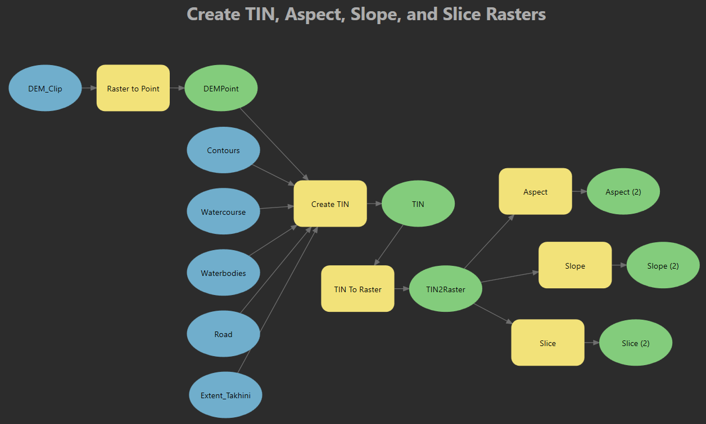
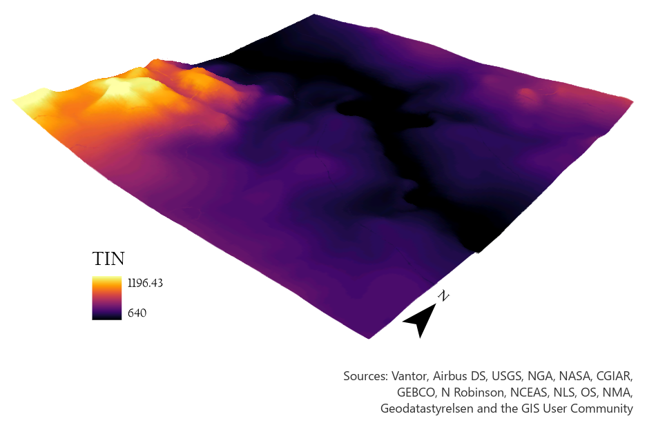
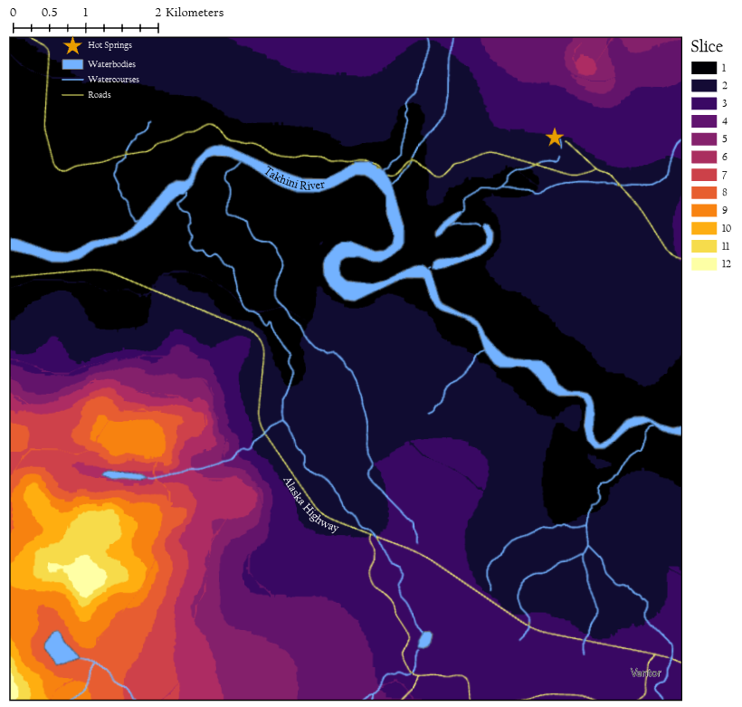
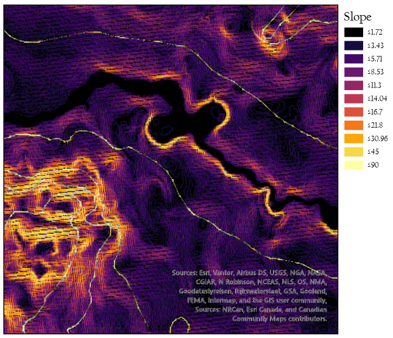
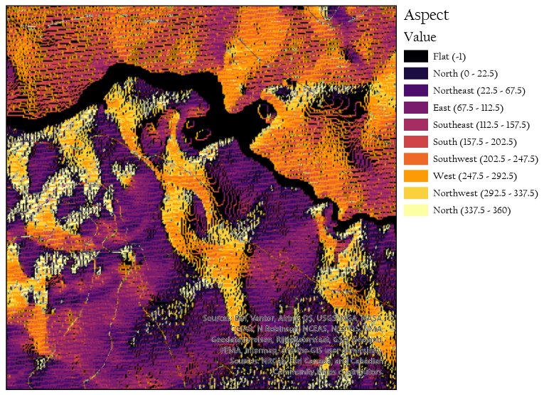
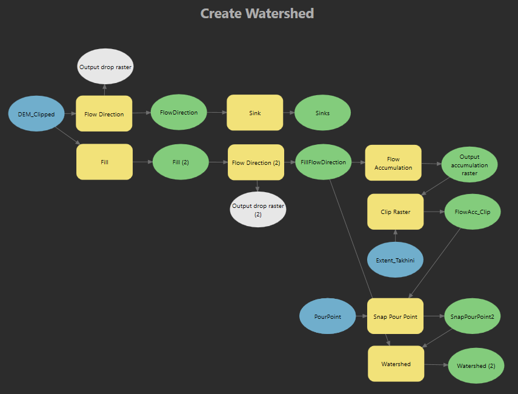
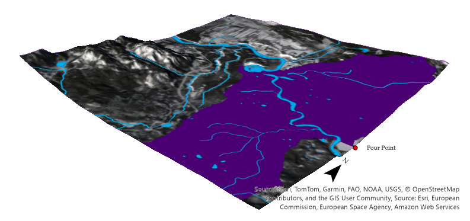
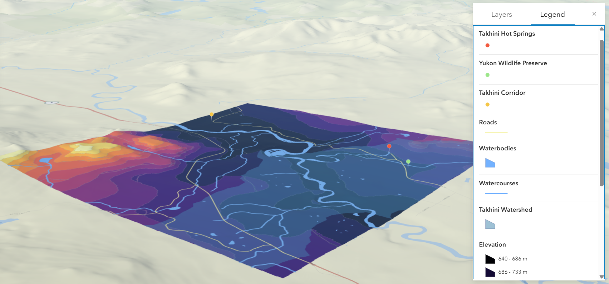

# GIS - 3D Analysis  

## Takhini Corridor, Yukon: 3D and Watershed Analysis   

<b>Purpose:</b> Use ArcGIS Pro ModelBuilder to areate a 3D TIN surface, along with a slice, aspect, slope, and watershed raster for a 10x10 km region in the Yukon Corridor, Canada.  
<b>Output:</b> TIN, slice, slope, and aspect rasters, watershed polygon, model builder tools, ArcGIS Online Web Scene  

### Background   

The Takhini Corridor in Yukon, Canada is a beautiful region rich with wildlife and geothermal activity. Approximately 30 minutes along the Alaska Highway northwest of Whitehorse, visitors will find the Takhini hot springs and wildlife preserve, where they'll have the opportunity to see the arctic fox, Canada lynx, moose, muskox, and red fox - among many other native species. With hiking trails, canoeing, dogsledding, horseback riding and more, the outdoor enthusiast will find themselves at home in this ecologically diverse region of northern Canada. Considering the environmentally sensitive nature of the region, a 3D analysis was performed with the aim of conducting a regional hydrological study to determine local runoff and drainage patterns.   

### 3D Surfaces   

A triangulated irregular network (TIN) is a 3D surface constituting many non-overlapping triangles that cover a region according to a pre-defined set of rules. It is often used as a vector format for a digital elevation model (DEM), and has lower storage requirements compared to gridded elevation data. In this case, a TIN was created using DEM points, contours, watercourses, roads,  waterbodies, and the 10x10 km Takhini extent.    

  
*Figure 1: ModelBuilder tool creating TIN, slice, aspect, and slope raster's using ArcGIS Pro 3D Analyst Tools*  

The DEM points were generated using the Raster to Point conversion tool, and used as elevation and mass points for representing point and multipoint features. Watercourses were used as a hard break line to interrupt surface smoothness, while contours and roads were used as soft break lines to ensure these linear features were maintained without defining an interruption in surface smoothness. Water bodies were used as a hard replace to represent areas of constant height, and an area of interest polygon was used as a hard clip to constrain the output to a predefined extent. Delaunay triangulation was used to prevent long, thin triangles, which are undesirable for surface analysis.   

This TIN was then converted to a raster with a cell size of 1 (figure 2). From this, slice (figure 3), slope (figure 4), and aspect (figure 5) raster's were created.   

  
*Figure 2: 3D TIN raster visualizing regional topography, with elevation units in meters using the CGVD2013a(2010) vertical datum. Higher elevations are shown in yellow. A DEM sourced from NRCan CanVec was used as the ground surface elevation source layer with a vertical exaggeration of 2. Topography plays an important role in the distribution of water within natural landscapes.*   

  
*Figure 3: Reclassified TIN raster created using ArcGIS Pro Slice 3D Analyst tool, symbolized based on elevation zone and displaying a 10x10km extent in the Takhini Corridor of Yukon, Canada. Highest elevation zones shown in yellow.*   

  
*Figure 4: Slope raster created with ArcGIS Pro Slope 3D Analyst tool, symbolized based on slope gradient.*   

Slope represents steepness, or the rate of change of elevation for each pixel measured in degrees. Here slope is visualized in 11 different classes. These topographic gradients will influence local hydrological pattens, with steeper slopes leading to a higher velocity and volume of runoff being released into the catchment area.    

  
*Figure 5: Aspect raster created with ArcGIS Pro Slope 3D Analyst tool, symbolized based on slope compass orientation.*   

Aspect represents the slope direction, with the output raster showing the compass direction of any given slope face. For a hydrological analysis, sun-facing slopes (which are oriented toward the south in the Northern hemisphere) tend to be warmer and drier than shaded slopes, resulting in differences in soil, vegetation, and drainage patterns. An example of this is during the spring melt, when snow can be expected to melt more quickly on south-facing slopes.    

### Hydrological Analysis   

Hydrological analysis is highly dependent on the scope of the area covered. In this case, the analysis was constrained to the area of interest, providing insight into localized drainage patterns.   

  
*Figure 6: ModelBuilder tool creating watershed.*   

The DEM was used as the input for the Flow Direction tool, creating an output raster with symbology corresponding to the direction water is likely to flow (ie. north, west, south, etc). This output was used to identify sinks, which often represent data anomalies or errors in hydrological analysis, rather than areas where water actually collects like a pond or lake. The anomalies were then fixed using the Fill tool, which created a new DEM where all sinks were changed to match the elevation of the lowest cell beside the sink. The Flow Direction tool was run again, now using the filled DEM as the input, followed by the Flow Accumulation tool which shows where water is most likely to accumulate. This was snapped to a feature class called PourPoint, with the point placed at the most downstream point of Takhini River in the area of interest, within 20 m of the nearest accumulation cell. The Watershed tool could then be run using this snapped raster as the input, creating a raster showing the watershed area upstream of the outlet which represents the area flowing to the specified outlet.   

  
*Figure 7: Watershed (symbolized in indigo) created using ArcGIS Pro Hydrology tools. Sentinel-2 satellite imagery was used as the base map, draped over the DEM ground elevation surface.*   

With the watershed of interest delineated, informed decisions can be made to optimize water quality monitoring in the region. Further study might use other hydrology tools to determine how fast water in the watershed will flow to the outlet, or might consider the hydrogeologic influence of bedrock geology, permeability, and aquifer drainage.   

### Web Scene   

A Web Scene was created using ArcGIS Online Web Scenes. Layers used include an elevation slice vector layer that was created using the reclassified TIN raster to display elevations as ‘zones’ throughout the region, a vector watershed that was created using the watershed raster, and a few areas of interest in the region. All layers - the elevation slices/zones, watershed, and points - are interactive. Clicking on an elevation slice will show the elevation range within that area, while the watershed and points of interest include explanations and descriptions.   

  
*Figure 8: ArcGIS Online Web Scene draped with vectorized versions of the reclassified TIN and watershed*   

### References   
- ArcGIS Pro Help/Documentation: Breaklines in surface modeling, Terrain schema properties, Fundamentals of TIN triangulation in ArcGIS, Deriving runoff characteristics, Aspect-Slope function
- Triangulated Irregular Network, ScienceDirect. https://www.sciencedirect.com/topics/earth-and-planetary-sciences/triangulated-irregular-network
- Fan, Y., Clark, M., Lawrence, D. M., Swenson, S., Band, L. E., Brantley, S. L., Brooks, P. D., Dietrich, W. E., Flores, A., Grant, G., Kirchner, J. W., Mackay, D. S., McDonnell, J. J., Milly, P. C. D., Sullivan, P. L., Tague, C., Ajami, H., Chaney, N., Hartmann, A., . . . Yamazaki, D. (2019). Hillslope Hydrology in Global change research and Earth System Modeling. Water Resources Research, 55(2), 1737–1772. https://doi.org/10.1029/2018wr023903
- Esri Academy, Performing a Hydrological Analysis Using ArcGIS Pro
- Travel Yukon, Discover the Takhini Corridor. https://www.travelyukon.com/en/see-and-do/itineraries/discover-takhini-corridor
- Yukon Wildlife Preserve, Our Wildlife. https://yukonwildlife.ca/learn/yukon-wildlife/
- Yukon Government. Major mine licensing. https://storymaps.arcgis.com/stories/4b3bae2c05054737a6884970450e01a6

  

### Disclaimer   

*Produced by: T.K.Wolfe, February 2026*  
*This product is intended for educational purposes only for the Geographic Information Sciences program at the Centre of Geographic Sciences, NSCC.*   

*Horizontal Datum & Projection: NAD 1983 Yukon Albers; Vertical Datum: CGVD 2013a(2010)*  
*Data sourced from: Government of Canada Geospatial Data Extraction, Yukon Open Data, ESRI Canada, European Space Agency*

