# GIS - Hydrological Analysis  

## Annapolis River, Nova Scotia, Canada   

<b>Purpose:</b> Perform hydrological flattening of rivers and lakes, hydrological enforcement to remove artificial barriers, determine the waterflow and watershed, and estimate flood extents for the Annapolis River, Nova Scotia.  
<b>Output:</b> Hydrologically flattened DEM, watershed and flood polygons, video animation of rising water levels  

### Provided Datasets   
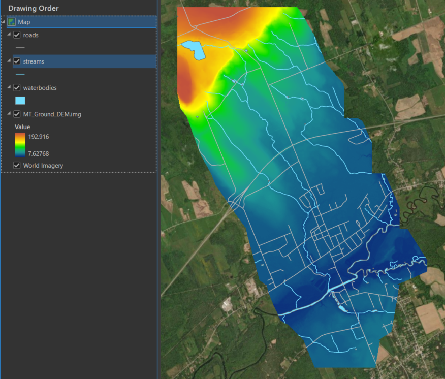  
<i>Map displaying provided datasets for the Annapolis River hydrological analysis, inlcuding roads, streams, waterbodies, and DEM</i>  

### Hydrological Flattening   

Elevatations in a LiDAR derived DEM tend to vary significantly across waterbodies. For this reason, hydrological flattening is used to modify the DEM to create truly flat waterbody surfaces. Water features such as lakes are largely level and are therefore flattened to a constant elevation, while rivers have a trending slope and are therefore flattened using more than a single elevation.   

<b>Flattening Rivers</b>  

To interpolate the surface of the river, first the tilted river surface is estimated in order to represent the downhill flow of water. This gradient surface will be used to update the DEM. The following steps outline the process of flattening the Annapolis River in ArcGIS Pro, using geoprocessing tools within Model Builder.  

1. <b>Select Layer by Attribute</b>: The river polygon is selected from the waterbodies feature class. First the waterbodies attribute table is referenced to determine the river ID.  
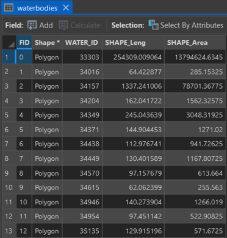  
*Attribute table for the waterbodies feature class, showing the Annapolis River with a feature ID of 0, and the remaining 26 lakes*  
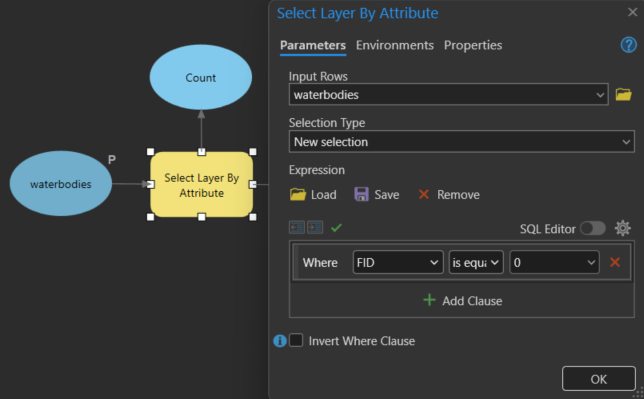  
*Selecting waterbodies where FID is equal to 0, which is the only river polygon in the area of interest*  
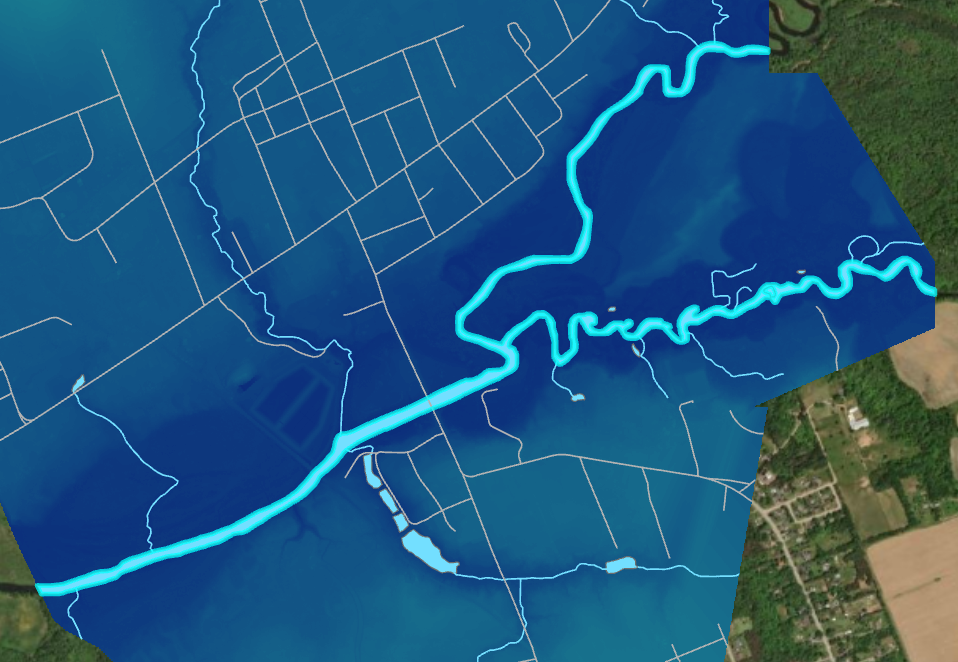  
*Map showing selection of Annapolis River*  

2. <b>Feature Vertices to Points</b>: Obtain a set of shoreline points for the river  
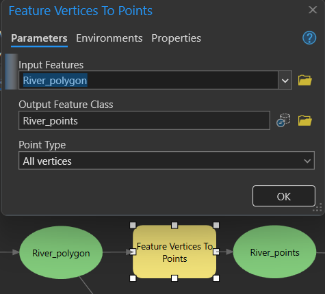  
*Feature Vertices to Points tool used to covert the selected Annapolis River polygon into a set of points*  
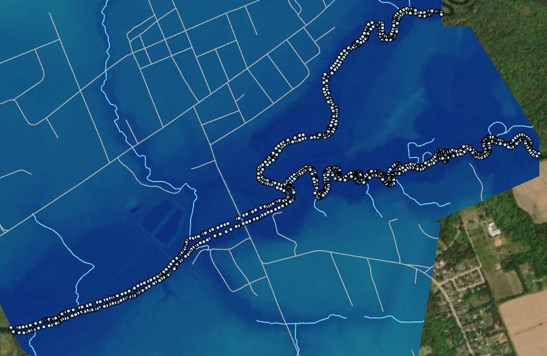  
*Shoreline points along the Annapolis River. These points currently have no associated height (Z) information*   

3. <b>Add Surface Information</b>: Add elevations to the shoreline points along the Annapolis River using the DEM  
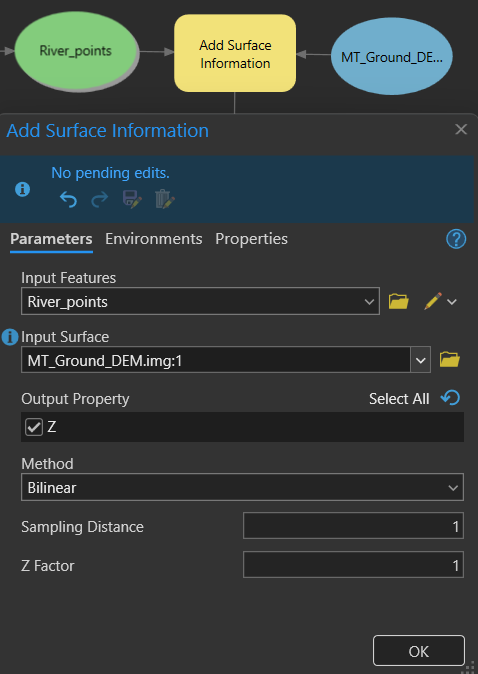  
*Using the river points as the input features, the DEM as the input surface, and the elevation (Z) value as the output property. Also using a sampling distance of 1 meter, which is equal to the cell size of the DEM*  
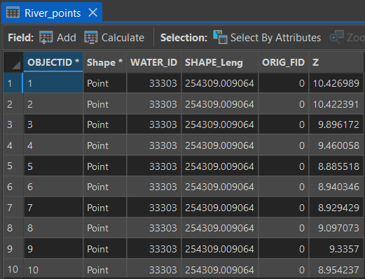  
*River points table now contains a field (Z) for elevation in meters*  

4. <b>Trend</b>: Interpolate a flat, gradient raster that covers the river   
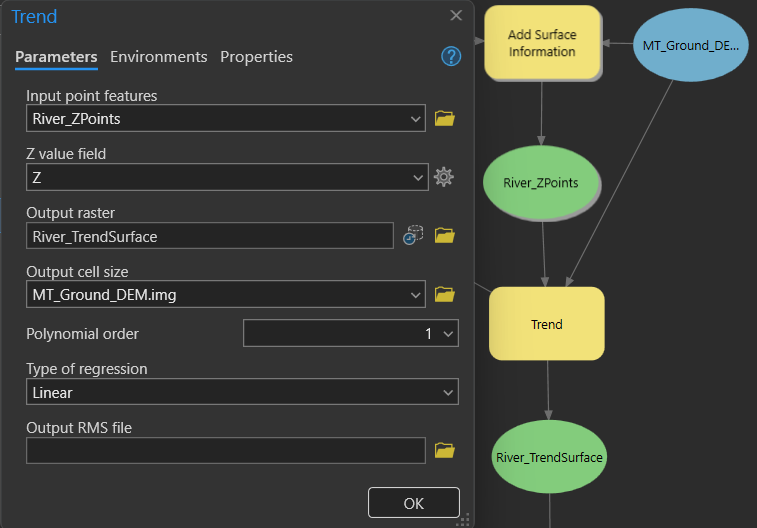  
*Determining the river trend using the river points with elevations, using Z as the elevation field. The environment settings have been specified to set the cell size to the same as the DEM, and to snap the output raster to the DEM, preventing errors in future analysis*  
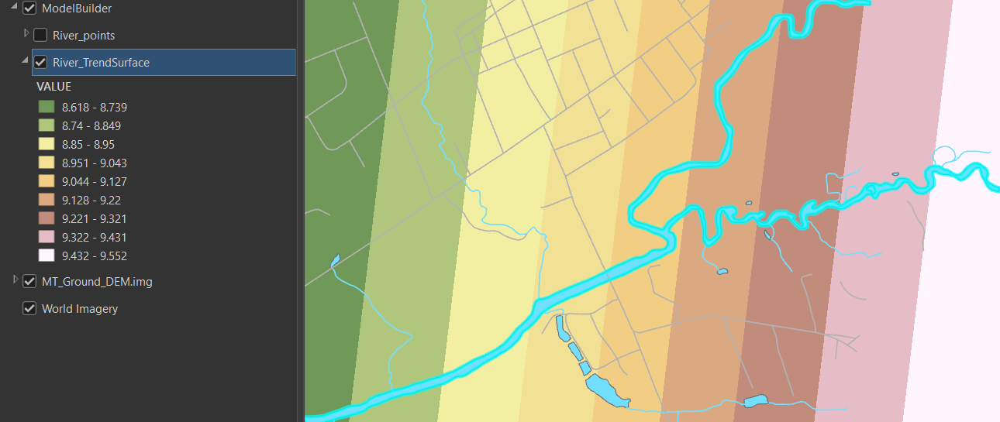  
*River trend raster, broken into 9 slices, each falling within a height range in meters. This shows the gradient of the river from high, in light pink, to low, in green*  

Once the river surface has been interpolated, the surface can be clipped to ensure it covers only the Annapolis River and the DEM can be updated with the new elevation values.  

5. <b>Extract by Mask</b>: Clip the trend raster to the rivers polygon to ensure only DEM elevations within the river area will be replaced   
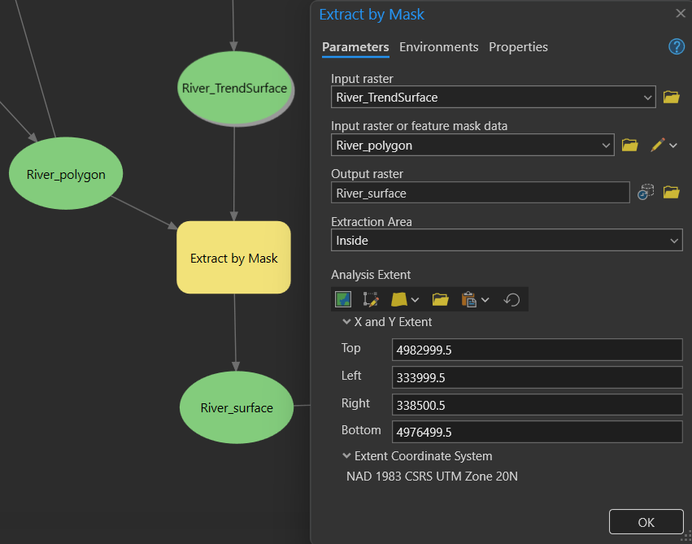  
*Extract by Mask tool using river polygon to clip the river trend surface to just the river area. Extent has been set to the same as the DEM, and raster has been snapped to the DEM*  

6. <b>Mosaic</b>: Update the existing DEM with the clipped interpolated raster   
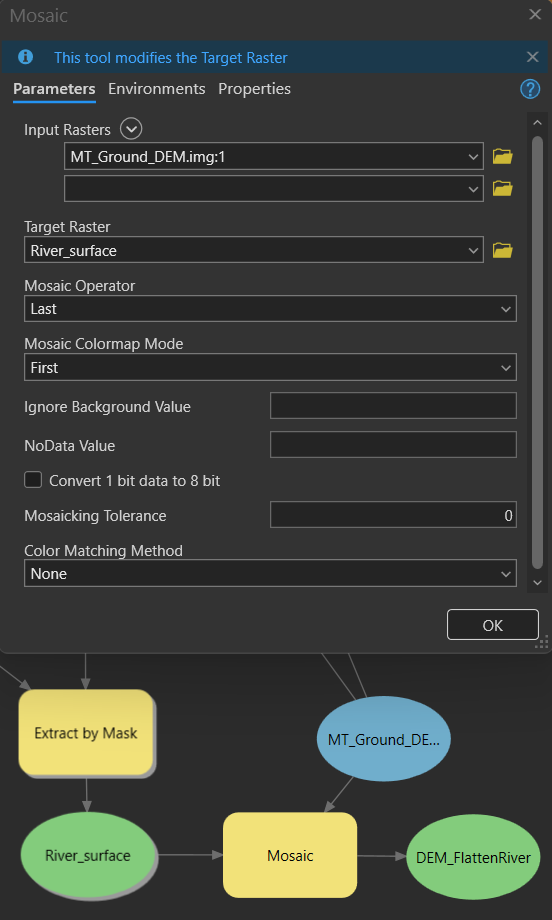  
*Mosaic tool using the river surface as a target raster to update the DEM input raster. After running, the DEM has been updated with the new flat, gradient river elevation values*  
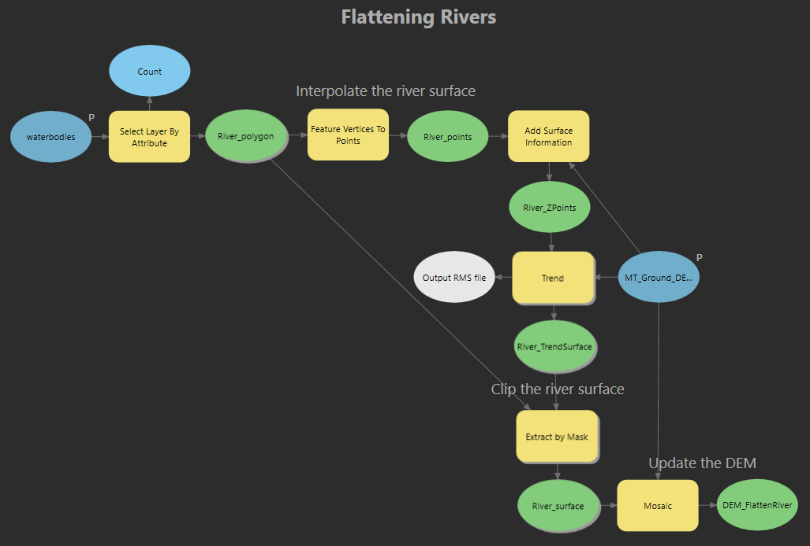  
*Complete flatten river model builder tool, with waterbodies and the DEM as input parameters*  

<b>Flattening Lakes</b>  

The DEM with flattened river elevation values will now be used to flatten the remaining lake water bodies. A similar process was used as in the Flatten Rivers model, however unlike rivers, lakes can be estimated as a flat and level surface. The first step is to derive a representative water level for the lake, which will be estimated by the lowest elevation around its shoreline.  

As there are many lakes, this model also required iterating through each lake individually. First, all lakes are selected and copied to a new feature class called “Lakes”. The Iterate Feature Selection iterator is used to iterate through each lake and flatten it individually. This is necessary as each lake will have a different minimum Z value.  

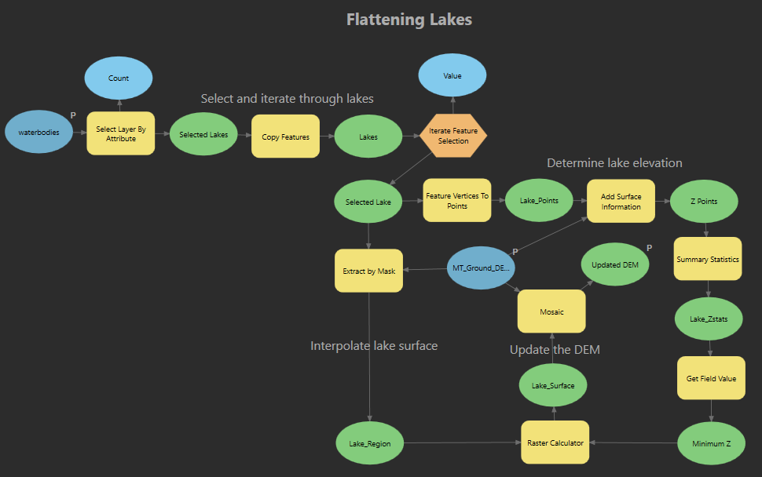  
*Flatten lakes model builder tool with waterbodies and DEM as input parameters. Geoprocessing tools were snapped to the DEM and used the DEM cell size and extent akin to the process used in the Flatten Rivers model*  

<b><i>Selecting and iterating through lakes:</b></i>  

1. <b>Select Layer by Attribute</b>: Create a new selection where feature ID is not equal to 0 (which is the ID of the river). All other features will be the lakes   

2. <b>Copy Features</b>: Copy all selected lakes to a new feature class called “Lakes”   

3. <b>Iterate Feature Selection</b>: Iterate through all features in the Lakes feature class. Each selected lake will be used as the input for determining it’s elevation, interpolating it’s surface, and updating the DEM. The DEM will be updated as many times as there are lakes   

<b><i>Determine Elevation:</b></i>  

4. <b>Feature Vertices to Points</b>: Obtain a set of shoreline points for the lakes   

5. <b>Add Surface Information</b>: Assign shoreline point elevations using the DEM   

6. <b>Summary Statistics</b>: Compute the minimum of all point elevations (minimum Z). Because the lake will have a constant elevation, instead of using the shoreline points to generate a trend surface, as was done with the rivers, the minimum elevation is used as the lake elevation   
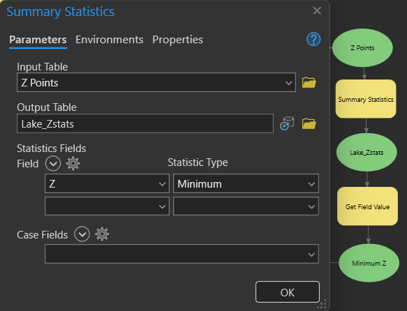  
*Creating a summary statistics table with the minimum elevation from the selected Z points around the circumference of the lake*  
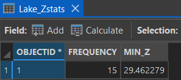  
*Lake Z stats table for the first lake*  

7. <b>Get Field Value</b>: Retrieve the minimum value from the statistics table   
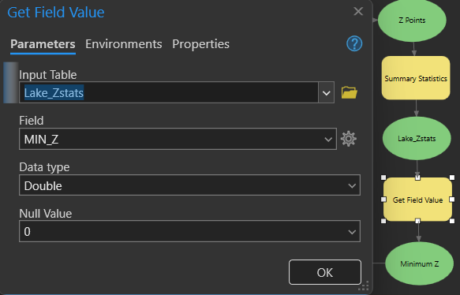  
*Get Field Value for retrieving the minimum Z values from the summary stats table*  

<b><i>Interpolate the Surface:</b></i>  

8. <b>Extract by Mask</b>: Create a raster from the DEM covering only the lake area   

9. <b>Raster Calculator</b>: Replace all cell values in this clipped raster with the constant minimum elevation value (minimum Z)   
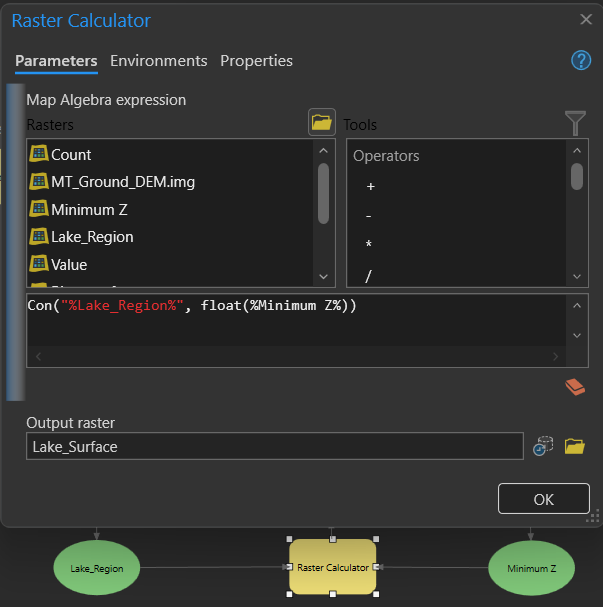  
*Raster calculator tool setting all values in the Lake region raster to a constant value equal to the minimum elevation*  

10. <b>Mosaic</b>: Update the existing DEM with the clipped interpolated raster   

### Hydrological Enforcement   

The DEM has now been updated with the new river and lake elevation values. The next step is the removal of man-made barriers which LiDAR may mistake for blockages. This could include major roadways where water may in fact flow past through culverts, for example.

<b>Removing Barriers</b>  

<b><i>Identification of barriers:</b></i>  

1. <b>Intersect</b>: Determine all locations where roads and streams intersect   

2. <b>Barriers Feature Class</b>: Create a new feature class called ‘barriers’ and draw polygons connecting low points on either side of the road, where they exist   
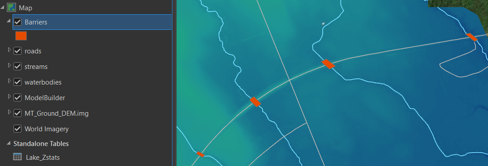  
*New barriers feature class showing polygons connecting low points on either side of Highway 101*  

Barriers will be removed by setting the cells under each barrier polygon to a value lower than in any other area.  

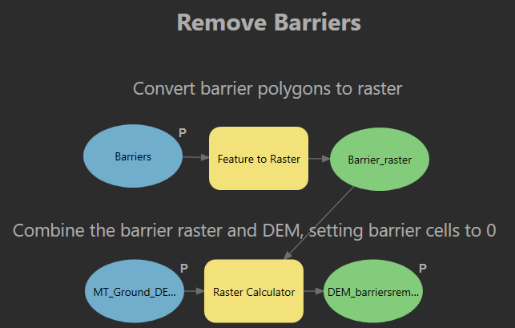  
*Remove Barriers model builder tool, with the Barriers feature class and DEM as inputs, and the DEM with barriers removed as the output*  

3. <b>Feature to Raster</b>: Convert barrier polygons into a raster in order to identify which DEM cells to adjust   

4. <b>Raster Calculator</b>: Combine the two rasters, setting barrier cells to a low value   
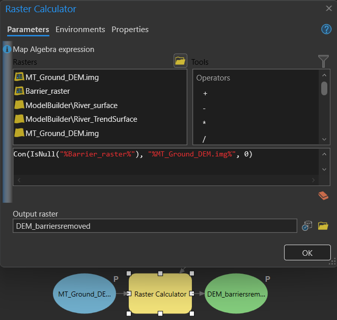  
*Raster calculator, which uses the DEM elevations wherever the Barrier raster is null, and changes the elevation to 0 wherever the barrier raster is not null*  

### Watershed   

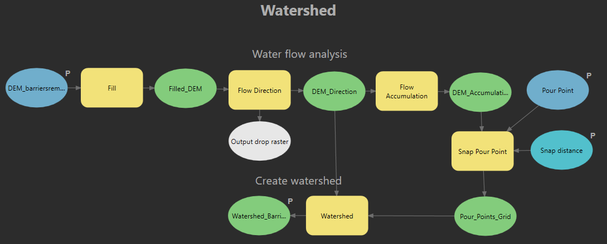  
*Watershed model builder tool with the DEM, Pour Point and Pour Point snap distance as input parameters, and watershed as the output parameter. A watershed is an area in which all water ultimately flows towards a single location at a lower elevation*  

<b><i>Determining the water flow:</b></i>  

1. <b>Fill</b>: Removing Sinks, which are small dips in the terrain where water may not be able to flow across, such as artificial features or random LiDAR errors   

2. <b>Flow Direction</b>: Determine terrain slope around each cell (the direction water will tend to flow)   

3. <b>Flow accumulation</b>: Tracks the number of cells flowing into each cell, providing an estimation of the major flow trends in the DEM   

<b><i>Creating the Watershed:</b></i>  

4. <b>Snap Pour Point</b>: The pour point is a choice of water destination that falls inside a cell of high water accumulation. In this case, the pour point was placed at lowest point of the Annapolis river. The measure distance tool was used to determine the distance from the pour point to the cell of highest accumulation, resulting in a snap distance of 20 m being used.   
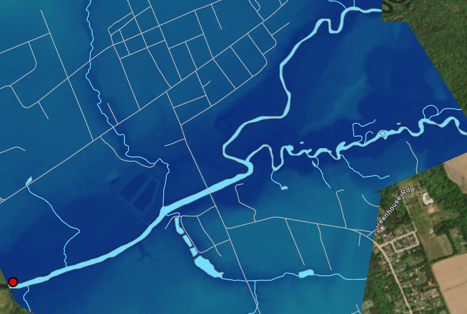  
*Location of pour point, shown at the most downstream end of the Annapolis River*  

5. <b>Watershed</b>: Tracks uphill of the pour point, including any cells that flow towards it.  
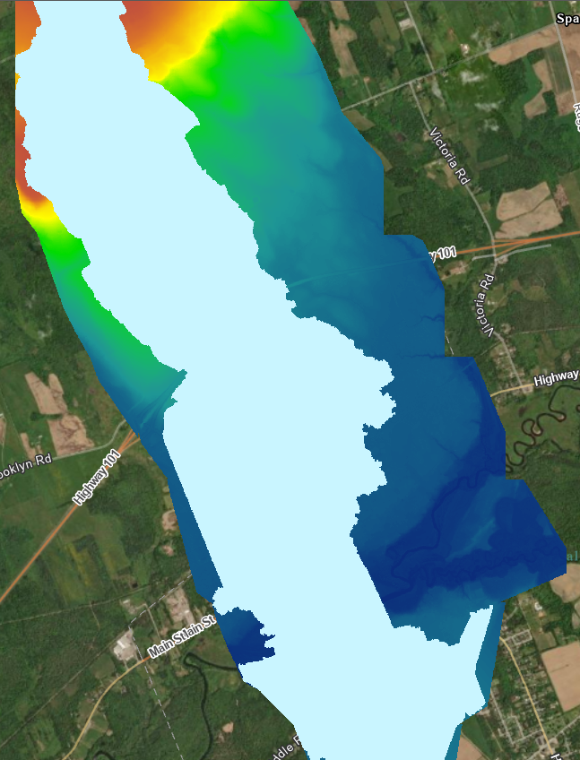  
*Resulting watershed polygon*  

### Flooding   

With the updated DEM surface and a known Pour Point, flood extents can be predicted based on input water levels. Two models were created in order to predict flooding extent. The Flood To Level mode creates an output polygon showing the flooded area at a specified water level, while the Flood by Increment model iterates through slowly increasing water levels in order to generate a collection of flood polygons. These output flood feature classes were used to create a flood animation video.

<b>Flood to a Specified Level</b>  

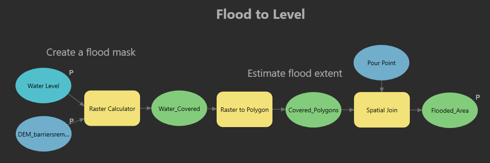  
*Flood to Level Model Builder tool, with water level (in m), the DEM with barriers removed, and the Pour Point as the input parameters, and Flooded Area polygon as the output*  

1. <b>Raster Calculator</b>: Create a mask covering any DEM cells below the specified water level.  
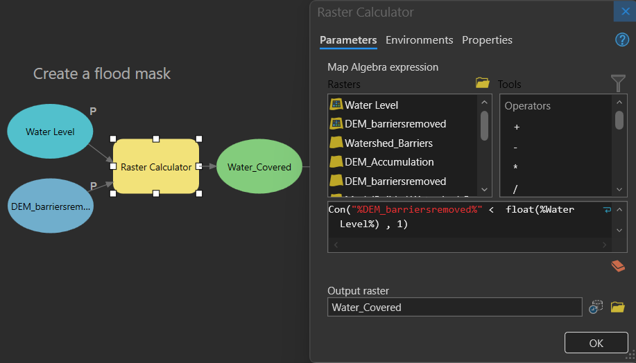  
*Raster calculator, creating an output of 1 for all cells in the DEM with barriers removed that have an elevation value less than the specified water level*  

2. <b>Raster to Polygon</b>: Convert the flood mask to polygons.  

3. <b>Spatial Join</b>: Select any polygons that contain pour points, using converted flood polygons as the Target Features and the pour points as the Join Features with a one-to-one join operation with the spatial operation of Intersect. This removes all isolated areas (ponds, depressions, etc) that wouldn’t truly be flooded by the river.  
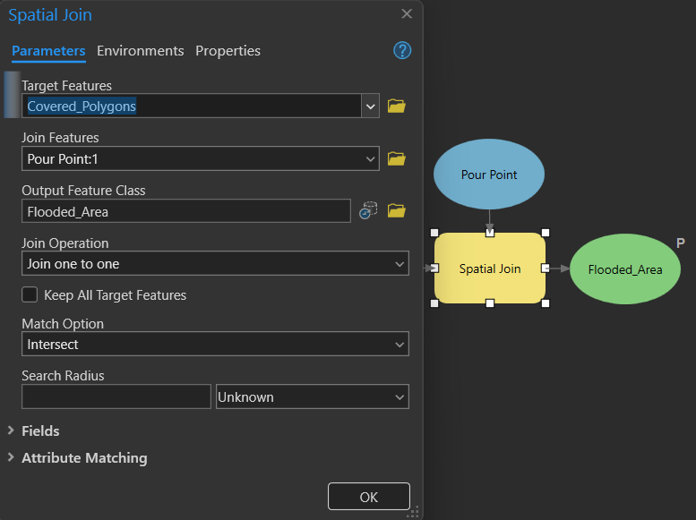  
*Spatial Join tool, selecting only polygons from the area covered by the water level which contain pour points. This ensures that only areas that could truly be flooded by the river are included in the final result*  
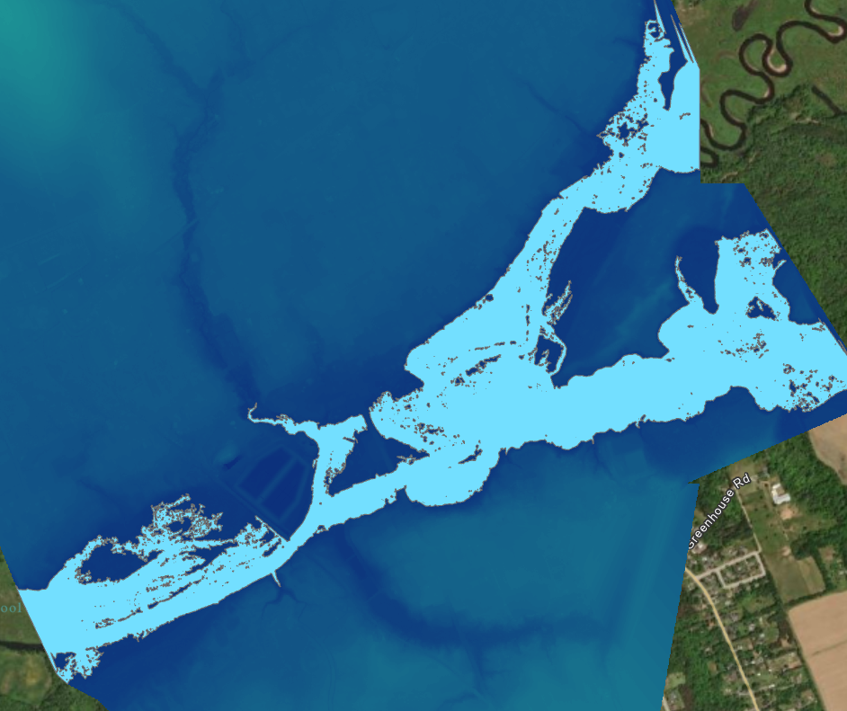  
*Flooded Area polygon result, with a water level of 12 m*  

<b>Flood by Increment</b>  

The flood by increment repeats the Flood by Level process for multiple, slowly increasing, water levels in order to simulate a natural flooding event. The For iterator takes three values: the lower value, upper value, and the value to increase by. Since the For iterator only works on integers, the input value in meters is converted to cm using calculate value, and then converted back to meters again. This value is passed into the Flood to Level model in order to create the flood polygons.  

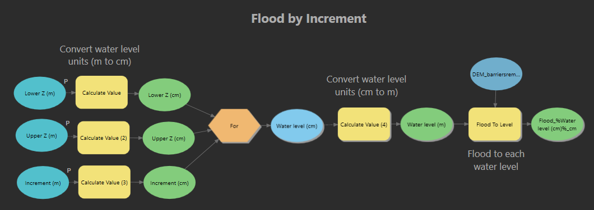  
*Flood by increment model builder tool. With the lower, upper, and increment water levels as input parameters*  

<b>Flood Animation</b>  

The following flood animation video shows water levels increasing from 10.5 to 12 m in the Annapolis River area of interest. This was created in ArcGIS Pro using the generated flood polygons as frames.  

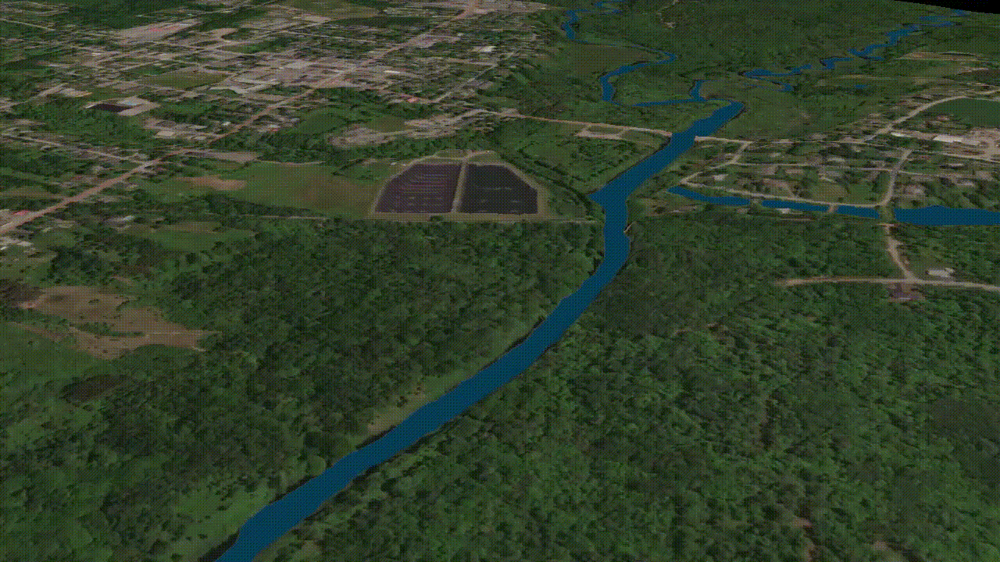  
*Annapolis River Flood Animation, showing water levels from 10.5 m to 12 m*  

  

### References   
- LiDAR / Hydrology Guide & Reference: Hydrological Applications, REMS 6090, COGS NSCC

  

### Disclaimer   

*Produced by: T.K.Wolfe, March 2026*  
*This product is intended for educational purposes only for the Geographic Information Sciences program at the Centre of Geographic Sciences, NSCC.*   

*Data sourced from: Hydrological vectors: Nova Scotia Geomatics Centre (NSGC) Base Data, LiDAR DEM: Derived from points acquired by the Applied Geomatics Research Group (AGRG)*

