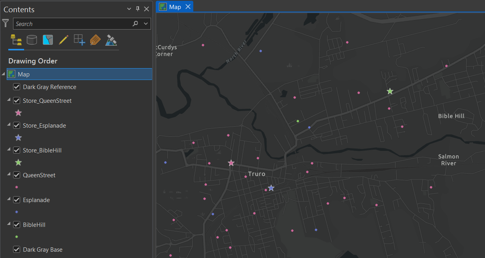
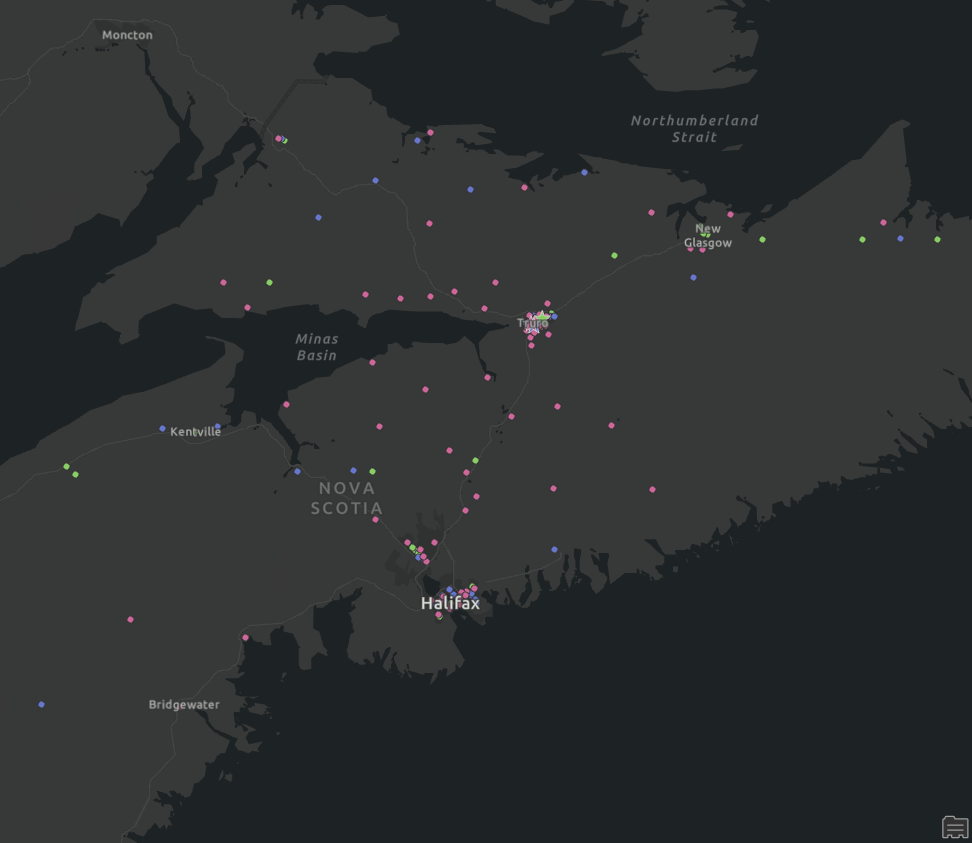
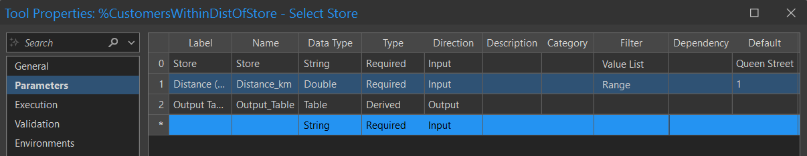
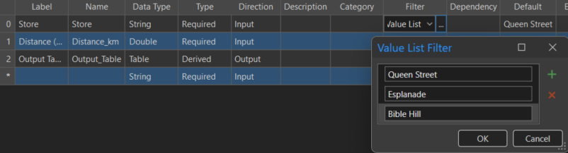
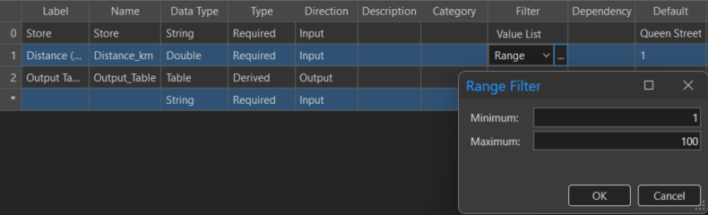
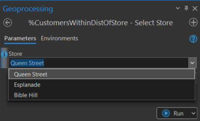
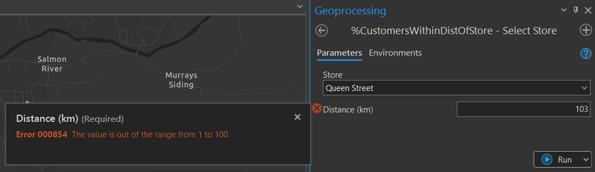
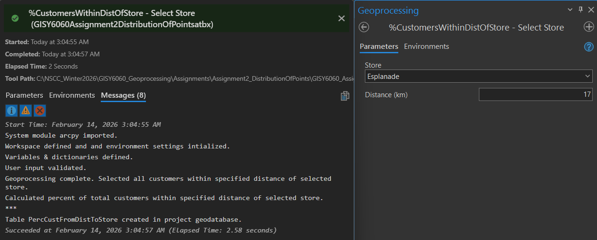
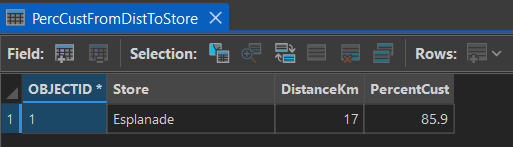

# Geoprocessing - ArcPy in ArcGIS Pro Notebooks<br><br>

## Customer Base Distribution: Using Select Layer by Location Geoprocessing Tool<br><br>

<b>Purpose:</b>
Write a python script and create a geoprocessing tool in ArcGIS Pro calculating the percent of a customer base within a given distance of their local store. The user should be able to select the store as an input and enter an integer as the interval distance, with a range from 1-100 km. <br>
<b>Output:</b> Table showing the percent of the selected store customer base that resides within the specified distance <br><br>

  
**Given**  
*Separate feature class files for the location of each store, as well as for each of their customer bases.*<br><br>


<br>
*Stores (starred) and their respective customer base (point) datasets displayed in ArcGIS Pro*<br><br>

  
<br>
*Distribution of customer base points across Nova Scotia*<br><br>

**Initializing Settings**  

```
# Import system modules
import arcpy

arcpy.AddMessage("System module arcpy imported.")

# Set to overwrite existing output files, allowing script to be run more than once
arcpy.env.overwriteOutput = True

# Define and set the workspace (the default location where files are saved)
# Using the path for the project geodatabase
workspace = r"C:\NSCC_Winter2026\GISY6060_Geoprocessing\Assignments\Assignment2_DistributionOfPoints\GISY6060_Assignment2_DistributionOfPoints\GISY6060_Assignment2_DistributionOfPoints.gdb"
arcpy.env.workspace = workspace

arcpy.AddMessage("Workspace defined and and environment settings intialized.")
```

**Creating variables for containing the paths of store and customer base feature classes**  

```
# Stores
store_queenstreet = r"C:\NSCC_Winter2026\GISY6060_Geoprocessing\Assignments\Assignment2_DistributionOfPoints\ForStudents\Datasets.gdb\Stores\Store_QueenStreet"
store_esplanade = r"C:\NSCC_Winter2026\GISY6060_Geoprocessing\Assignments\Assignment2_DistributionOfPoints\ForStudents\Datasets.gdb\Stores\Store_Esplanade"
store_biblehill = r"C:\NSCC_Winter2026\GISY6060_Geoprocessing\Assignments\Assignment2_DistributionOfPoints\ForStudents\Datasets.gdb\Stores\Store_BibleHill"

# Customers
queenstreet = r"C:\NSCC_Winter2026\GISY6060_Geoprocessing\Assignments\Assignment2_DistributionOfPoints\ForStudents\Datasets.gdb\Customers\QueenStreet"
esplanade = r"C:\NSCC_Winter2026\GISY6060_Geoprocessing\Assignments\Assignment2_DistributionOfPoints\ForStudents\Datasets.gdb\Customers\Esplanade"
biblehill = r"C:\NSCC_Winter2026\GISY6060_Geoprocessing\Assignments\Assignment2_DistributionOfPoints\ForStudents\Datasets.gdb\Customers\BibleHill"
```

**Creating dictionaries**  

```
# Link store names with store feature class paths
# This will be used to associate the dropdown menu selection with the store feature class path
storenames = {
    "Queen Street": store_queenstreet,
    "Esplanade": store_esplanade,
    "Bible Hill": store_biblehill
}

# Link store and customer feature class paths
# This will be used to determine the correct customer base once the store has been selected
storecustomers = {
    store_queenstreet: queenstreet,
    store_esplanade: esplanade,
    store_biblehill: biblehill
}

arcpy.AddMessage("Variables & dictionaries defined.")
```

**Requesting user input**  

```
# Define the first user input parameter. User will select a store 
# This will be set as a dropdown menu later, in the script properties parameters tab
store = arcpy.GetParameterAsText(0) 

# Determine the store feature class, looking up the file path from the storenames dictionary
storefc = storenames[store]
# Determine the customer base, looking up the file path from the storecustomers dictionary
cust = storecustomers[storefc]

# Create feature layers from the feature class paths. 
# These will be used for selecting the store and customer features when performing geoprocessing
arcpy.management.MakeFeatureLayer(storefc, "store_lyr")
arcpy.management.MakeFeatureLayer(cust, "cust_lyr")

# Define the second user input paramter. User will input a distance from the selected store
# Distance validation to ensure distance falls within a rang of 1 to 100 will be specified in the script parameters
dist = arcpy.GetParameter(1)

arcpy.AddMessage("User input validated.")
```

**Geoprocessing: Select all customers within specified distance of the selected store**  

```
# Select all customers within the specified distance of the selected store using SelectLayerByLocation
arcpy.management.SelectLayerByLocation(
    in_layer = "cust_lyr",
    overlap_type = "WITHIN_A_DISTANCE",
    select_features = "store_lyr",
    search_distance = f"{dist} Kilometers", # Converts distance into a string and adds kilometers. ArcPt will parse and convert to numeric internally
    selection_type = "NEW_SELECTION",
    invert_spatial_relationship = "NOT_INVERT"
)

arcpy.AddMessage("Geoprocessing complete. Selected all customers within specified distance of selected store.")
```

**Calculate: Percent of customers in region**  

```
# Get the total number of selected points in the customer layer
# GetCount returns a result object, not a number. The index of [0] extract the first and only value from this object, which is converted to an integer
custcount = int(arcpy.management.GetCount("cust_lyr")[0])
# Get the total number of points in the customer layer
totalcount = int(arcpy.management.GetCount(cust)[0])
# Calculate the percentage of the customer base currently selected
percent = round((custcount / totalcount * 100), 1)

arcpy.AddMessage("Calculated percent of total customers within specified distance of selected store.")
```
  
**Store calculation in a new table "PercCustFromDistToStore**  

```
# Define a path and name for the output table that will be created
outputtable = workspace + "\\PercCustFromDistToStore"
# Define the third script parameter as the defined output table
arcpy.SetParameterAsText(2, outputtable)
# Create the output table entitled PercCustFromDistToStore
arcpy.management.CreateTable(workspace, "PercCustFromDistToStore")
# Add 3 fields to the table which is stored in the defined outputtable path (store, distance, and percentcust)
arcpy.AddField_management(outputtable, "Store", "Text")
arcpy.AddField_management(outputtable, "DistanceKm", "Float")
arcpy.AddField_management(outputtable, "PercentCust", "Float")

# Insert cursor allowing data to be added to table
cursor = arcpy.da.InsertCursor(outputtable, ["Store", "DistanceKm", "PercentCust"])

# Add data to table
cursor.insertRow([store, dist, percent])

# Delete cursor
del cursor

arcpy.AddMessage("***")
arcpy.AddMessage("Table PercCustFromDistToStore created in project geodatabase.")
```

**ArcGIS Pro Script Parameters**<br><br>
 <br> 
*Geoprocessing script parameters allowing for store and distance input, and table output.*  
<br><br>

 <br>
*The filter list that was created, giving users the option to select a store of interest from the dropdown list. Default value is Queeen Street*<br><br>

 <br>
*A distance range was applied to ensure input is between 1 and 100 km. Default value is 1 km*<br><br>

**ArcGIS Pro Geoprocessing Tool**<br><br>
<br>  
*Geoprocessing tool with the store dropdown menu displayed*<br><br>

  <br>
*Geoprocessing tool with invalid distance error message displayed*<br><br>

  <br>
*Geoprocessing tool with a successful run message displayed*<br><br>

**Result: Output Table**<br><br>
  <br>
*The output table shows the percent of the selected store customer base that resides within the specified distance*<br><br>

### Disclaimer <br>

*Produced by: T.K.Wolfe, February 2026* <br>
*This product is intended for educational purposes only for the Geographic Information Sciences program at the Centre of Geographic Sciences, NSCC.* <br><br>
